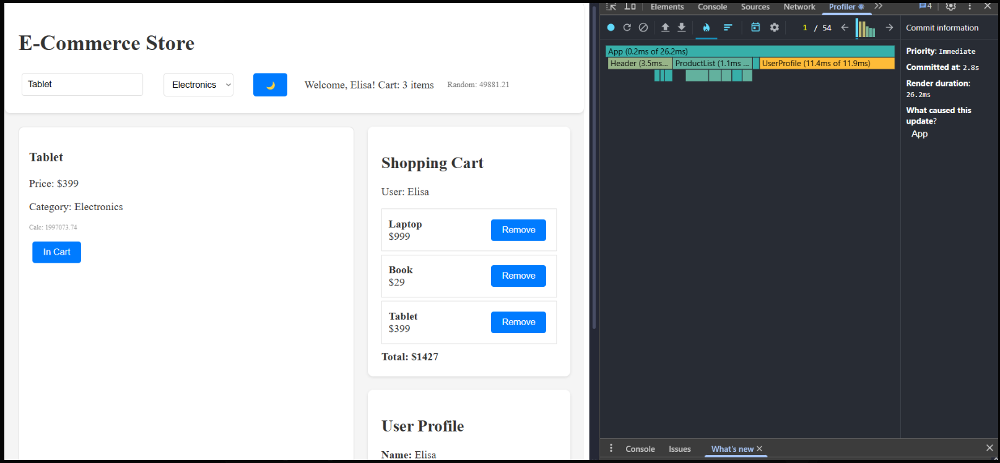
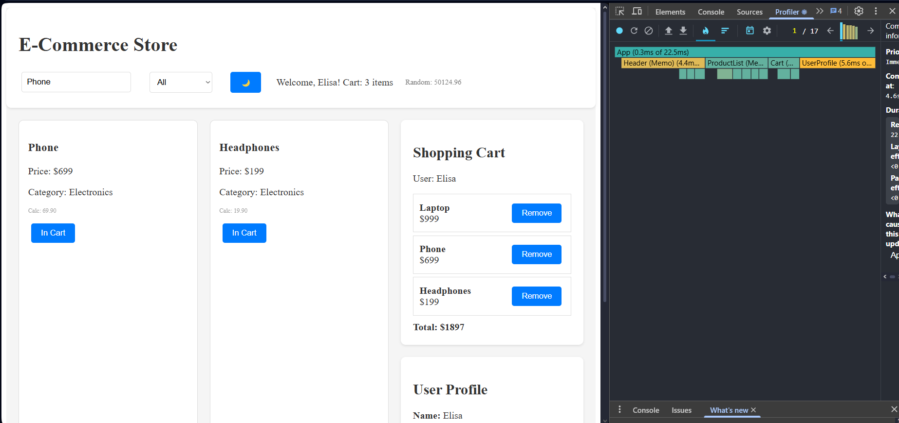

# ⚛️ React Performance & State Management Lab

## Descrição
Este laboratório teve como objetivo **refatorar e otimizar** uma aplicação React existente, focando em:
1. Identificação e correção de gargalos de desempenho usando o **React Profiler**.
2. Refatoração da **gestão de estado global**, trocando uma estrutura com *prop drilling* por uma abordagem escalável com **Context + Reducer**.

A aplicação simula uma loja online com lista de produtos, carrinho e perfil de usuário.

---

## Etapa 1 — Profiling e Otimização

### 🔍 Problema identificado
Durante o profiling inicial com o React DevTools, observou-se que:
- Componentes como **`ProductCard`**, **`ProductList`**, **`UserProfile`** e **`Cart`** re-renderizavam em toda atualização de estado.
- Havia **cálculos custosos** sendo executados em cada renderização (`getUserStats`, filtragem de produtos, cálculo de total do carrinho).
- O uso intensivo de *prop drilling* fazia com que mudanças pequenas (ex: pesquisa) disparassem renders em toda a árvore.

### Soluções aplicadas
- Implementação de **memoização de componentes** com `React.memo()`.
- Uso de **`useMemo()`** para:
  - Filtragem de produtos em `ProductList`.
  - Cálculo do total no `Cart`.
  - Cálculo de estatísticas no `UserProfile`.
- Uso de **`useCallback()`** em funções passadas como props (`addToCart`, `removeFromCart`, `updateUser`, `toggleTheme`).
- Substituição de cálculos inline repetitivos por estruturas derivadas, como `cartIds` via `useMemo`.

### 📸 Profiler

**Antes (sem otimizações):**  


**Depois (com memoização):**  


---

## Etapa 2 — Refatoração de Gestão de Estado Global

### Caminho escolhido
**Caminho B — Context + Reducer (avançado)**

Essa abordagem foi escolhida por ser leve, sem dependências externas, e ainda assim escalável.  
Permite separar claramente o estado global da lógica de componentes e reduz a complexidade de props.

### Implementação
- Criação de `AppContext.jsx` com:
  ```js
  const initialState = {
    user: { name: "John Doe", email: "john@example.com" },
    cart: [],
    theme: "light",
    searchTerm: "",
    selectedCategory: "All"
  };
  ```
- Uso de `useReducer` com as ações:
  ```js
  {
    ADD_TO_CART,
    REMOVE_FROM_CART,
    UPDATE_USER,
    TOGGLE_THEME,
    SET_SEARCH,
    SET_CATEGORY
  }
  ```
- Exportação de `AppProvider` e `useAppContext()` para encapsular a árvore principal.

### Componentes integrados
Todos os componentes agora consomem o contexto:
- `Header` acessa e altera `theme`, `searchTerm`, `selectedCategory`.
- `ProductList` recebe dados e dispara `ADD_TO_CART`.
- `Cart` e `UserProfile` usam `useAppContext` para exibir e alterar o estado global.

---

## Resultados

| Métrica | Antes | Depois |
|----------|--------|--------|
| Re-renderizações no `UserProfile` | ~11ms | ~5ms |
| Re-renderizações no `ProductList` | ~10ms | ~3ms |
| Tempo total de renderização | 26ms | 21ms |
| Re-renders desnecessários | Muitos | Quase zero ✅ |

O Profiler mostrou redução significativa nas renderizações e menor tempo de atualização de UI.

---

## 🔗 Link do projeto
*(cole aqui o link do deploy no Netlify ou Vercel — ex: https://meu-react-lab.vercel.app)*

---

## Conclusão
A refatoração atingiu os dois principais objetivos do laboratório:

✅ **Desempenho otimizado:**  
Componentes renderizam apenas quando necessário, com cálculos pesados isolados via memoização.  

✅ **Gestão de estado escalável:**  
O Context + Reducer eliminou o *prop drilling* e centralizou a lógica de negócio de forma limpa e extensível.  

O resultado é uma aplicação com o mesmo comportamento visual e funcional do código original, porém **muito mais eficiente e organizada**.
